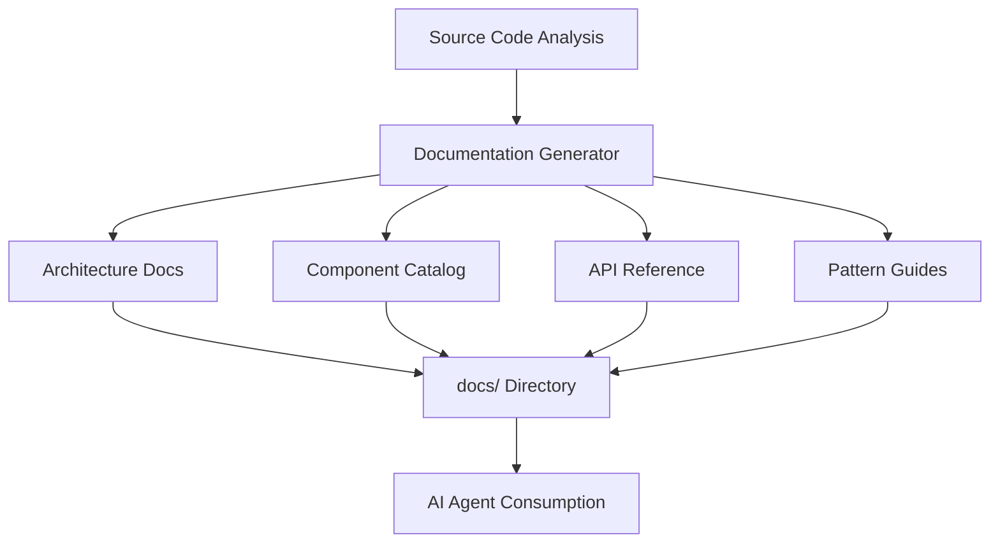

# Design Document: AI-Oriented Documentation

## Overview

This design document outlines the technical approach for creating comprehensive AI-oriented documentation for the TailAdmin project. The documentation system will generate structured Markdown files that enable AI agents to understand the project architecture, components, patterns, and conventions.

### Goals

- Generate comprehensive documentation covering all 16 requirement areas
- Structure documentation for optimal AI agent consumption
- Provide code examples, diagrams, and cross-references
- Maintain documentation in the `docs/` directory
- Enable AI agents to effectively navigate, understand, and modify the TailAdmin codebase

### Non-Goals

- Runtime documentation generation or hot-reloading
- Interactive documentation UI (focus is on Markdown files)
- Automated documentation updates on code changes (initial generation only)
- API documentation for external consumers (focus is on internal AI agent consumption)

## Architecture

### Documentation Generation Approach

The documentation will be generated through a systematic analysis of the TailAdmin codebase, following this architecture:



### Documentation Structure

The documentation will be organized into the following files within the `docs/` directory:

1. **index.md** - Entry point with table of contents and navigation
2. **architecture.md** - Project structure, routing, layouts, dependencies
3. **components.md** - Complete component catalog with usage examples
4. **styling.md** - Tailwind CSS configuration, theming, dark mode
5. **state-management.md** - Context providers, hooks, state patterns
6. **routing.md** - Next.js App Router, route groups, navigation
7. **forms.md** - Form components, validation, input patterns
8. **data-visualization.md** - Charts, maps, calendar components
9. **tables.md** - Table components, pagination, sorting
10. **modals-dropdowns.md** - Modal and dropdown patterns
11. **icons.md** - Icon system and usage
12. **typescript.md** - Types, interfaces, type patterns
13. **configuration.md** - Build configuration, tooling setup
14. **integration-patterns.md** - Patterns for extending the project
15. **assets.md** - Asset management and organization
16. **accessibility.md** - Accessibility patterns and best practices

### Analysis Strategy

The documentation generator will analyze the codebase through:

1. **File System Traversal** - Map directory structure and file organization
2. **Component Analysis** - Extract component props, dependencies, and usage patterns
3. **Configuration Parsing** - Document build and tooling configurations
4. **Pattern Recognition** - Identify common patterns and conventions
5. **Cross-Reference Building** - Create links between related documentation sections

## Components and Interfaces

### Documentation Generator

The core component responsible for generating all documentation files.

**Responsibilities:**
- Traverse the TailAdmin source code
- Extract relevant information for each documentation area
- Generate Markdown files with consistent formatting
- Create cross-references and navigation links

**Key Functions:**
- `generateArchitectureDoc()` - Analyzes project structure and generates architecture.md
- `generateComponentCatalog()` - Extracts component information and generates components.md
- `generateStylingDoc()` - Documents Tailwind CSS and theming
- `generateStateManagementDoc()` - Documents context and hooks
- `generateRoutingDoc()` - Documents Next.js routing structure
- `generateFormsDoc()` - Documents form components and patterns
- `generateDataVizDoc()` - Documents charts and visualization components
- `generateTablesDoc()` - Documents table components
- `generateModalsDropdownsDoc()` - Documents modal and dropdown patterns
- `generateIconsDoc()` - Documents icon system
- `generateTypeScriptDoc()` - Documents types and interfaces
- `generateConfigDoc()` - Documents build configuration
- `generateIntegrationPatternsDoc()` - Documents extension patterns
- `generateAssetsDoc()` - Documents asset management
- `generateAccessibilityDoc()` - Documents accessibility patterns
- `generateIndexDoc()` - Creates navigation and table of contents

### Documentation Templates

Structured templates for consistent documentation formatting.

**Template Structure:**
```markdown
# [Section Title]

## Overview
[Brief description of the section]

## [Subsection]
[Detailed content]

### Code Example
```[language]
[code snippet]
```

## Cross-References
- See also: [Related Section](./related.md)
```

### Component Extractor

Utility for extracting component information from source files.

**Extracted Information:**
- Component name and file path
- Props interface with types
- Dependencies (imported components)
- Usage examples from existing code
- Component category (auth, charts, forms, etc.)

### Pattern Analyzer

Utility for identifying common patterns in the codebase.

**Identified Patterns:**
- Component composition patterns
- State management patterns
- Styling patterns
- Naming conventions
- File organization conventions

## Data Models

### DocumentationSection

Represents a single documentation file.

```typescript
interface DocumentationSection {
  filename: string;           // e.g., "components.md"
  title: string;              // e.g., "Component Catalog"
  content: string;            // Markdown content
  crossReferences: string[];  // Links to related sections
  codeExamples: CodeExample[];
}
```

### CodeExample

Represents a code snippet in documentation.

```typescript
interface CodeExample {
  language: string;           // e.g., "typescript", "tsx"
  code: string;               // The code snippet
  description: string;        // Explanation of the example
  filename?: string;          // Source file if extracted from codebase
}
```

### ComponentInfo

Represents extracted component information.

```typescript
interface ComponentInfo {
  name: string;               // Component name
  path: string;               // File path relative to src/
  category: string;           // e.g., "auth", "charts", "forms"
  props: PropInfo[];          // Component props
  dependencies: string[];     // Imported components
  usageExamples: string[];    // Code examples
  description: string;        // Component purpose
}
```

### PropInfo

Represents a component prop.

```typescript
interface PropInfo {
  name: string;               // Prop name
  type: string;               // TypeScript type
  required: boolean;          // Is prop required
  defaultValue?: string;      // Default value if any
  description: string;        // Prop description
}
```

### DirectoryNode

Represents the project directory structure.

```typescript
interface DirectoryNode {
  name: string;               // Directory or file name
  path: string;               // Full path
  type: 'directory' | 'file'; // Node type
  description: string;        // Purpose description
  children?: DirectoryNode[]; // Subdirectories/files
}
```

## Error Handling

### File System Errors

**Error:** Unable to read source files or write documentation files
**Handling:** 
- Log specific file path and error message
- Continue with remaining documentation generation
- Report summary of failed operations at the end

### Parsing Errors

**Error:** Unable to parse TypeScript/TSX files for component extraction
**Handling:**
- Log the problematic file
- Skip detailed component analysis for that file
- Include basic file information in documentation

### Missing Information

**Error:** Expected configuration or pattern not found
**Handling:**
- Document what was found vs. what was expected
- Provide placeholder sections with notes about missing information
- Continue with available information

### Invalid Cross-References

**Error:** Referenced file or section doesn't exist
**Handling:**
- Validate all cross-references before writing files
- Remove or update invalid references
- Log warnings for manual review

## Testing Strategy

### Unit Tests

Since this is a documentation generation feature (side-effect operation creating files), property-based testing is not applicable. Testing will focus on:

1. **Component Extraction Tests**
   - Test extraction of component props from sample TSX files
   - Test identification of component dependencies
   - Test categorization of components

2. **Markdown Generation Tests**
   - Test generation of valid Markdown syntax
   - Test code block formatting with syntax highlighting
   - Test cross-reference link formatting

3. **Directory Traversal Tests**
   - Test correct identification of project structure
   - Test filtering of irrelevant directories (node_modules, .next, etc.)
   - Test path resolution for cross-platform compatibility

4. **Template Rendering Tests**
   - Test consistent header hierarchy
   - Test table of contents generation
   - Test navigation link generation

### Integration Tests

1. **End-to-End Documentation Generation**
   - Generate complete documentation set
   - Verify all expected files are created in docs/
   - Verify file content structure matches templates

2. **Cross-Reference Validation**
   - Verify all internal links point to existing sections
   - Verify navigation structure is complete
   - Verify index.md contains all section links

3. **Content Completeness**
   - Verify each requirement area has corresponding documentation
   - Verify code examples are syntactically valid
   - Verify all major components are documented

### Manual Validation

1. **AI Agent Consumption Test**
   - Provide generated documentation to an AI agent
   - Test agent's ability to navigate and understand the documentation
   - Test agent's ability to answer questions about the codebase using the documentation

2. **Documentation Quality Review**
   - Review for clarity and completeness
   - Review for consistent formatting
   - Review for accurate technical information

### Test Configuration

- Use Jest or Vitest for unit and integration tests
- Mock file system operations for unit tests
- Use temporary directories for integration tests
- Clean up generated test files after test runs

## Implementation Notes

### Technology Stack

- **Language:** TypeScript
- **File System:** Node.js `fs` module
- **Markdown Generation:** Template strings with proper escaping
- **TypeScript Parsing:** TypeScript Compiler API for component analysis
- **Diagram Generation:** Mermaid syntax embedded in Markdown

### Generation Script

Create a standalone script that can be run via npm:

```json
{
  "scripts": {
    "generate:docs": "tsx scripts/generate-docs.ts"
  }
}
```

### Incremental Generation

While initial scope is one-time generation, structure the code to support:
- Regenerating individual documentation sections
- Updating specific components without full regeneration
- Merging manual edits with generated content (future enhancement)

### Documentation Maintenance

- Include generation timestamp in each file
- Add disclaimer that files are generated (can be manually edited)
- Provide clear instructions for regenerating documentation

