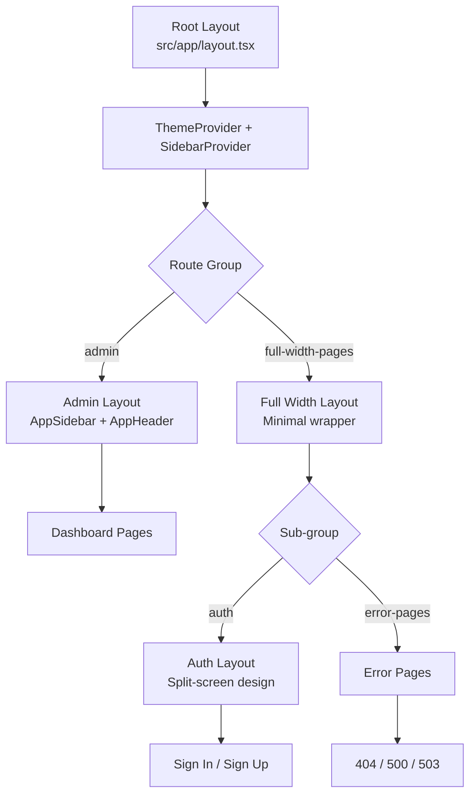
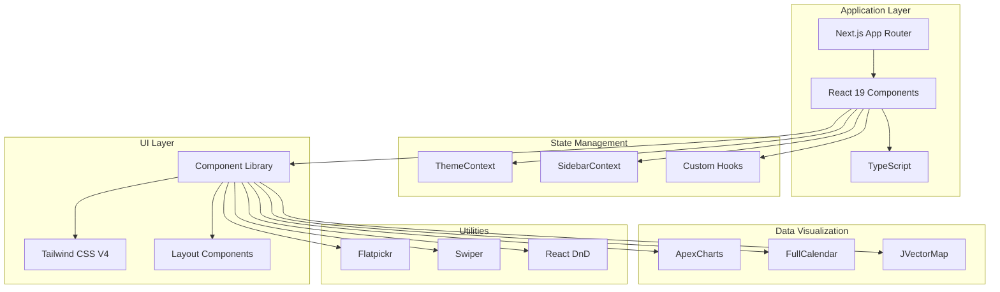

# Architecture Documentation

**Generated:** 2026-04-03T23:28:14.069Z

## Overview

TailAdmin is a Next.js 16 admin dashboard template built with React 19, TypeScript, and Tailwind CSS V4. It follows the Next.js App Router architecture with route groups for organizing different sections of the application.

## Project Structure

### Root Directory Structure

```
TailAdmin/
├── src/                    # Source code
│   ├── app/               # Next.js App Router pages
│   ├── components/        # React components
│   ├── context/           # React Context providers
│   ├── hooks/             # Custom React hooks
│   ├── icons/             # SVG icon assets
│   └── layout/            # Layout components
├── public/                # Static assets
│   └── images/           # Image assets
├── scripts/               # Build and utility scripts
├── docs/                  # Generated documentation
├── package.json           # Project dependencies
├── next.config.ts         # Next.js configuration
├── tailwind.config.ts     # Tailwind CSS configuration (implicit)
└── tsconfig.json          # TypeScript configuration (implicit)
```

### Source Directory Structure

```
src/
├── app/                   # Next.js App Router
│   ├── (admin)/          # Admin dashboard route group
│   │   ├── (others-pages)/  # Charts, forms, tables, calendar
│   │   │   ├── (chart)/     # Chart pages (bar, line)
│   │   │   ├── (forms)/     # Form pages (input, select, etc.)
│   │   │   ├── (tables)/    # Table pages
│   │   │   ├── blank/       # Blank page template
│   │   │   ├── calendar/    # Calendar page
│   │   │   └── profile/     # User profile pages
│   │   ├── (ui-elements)/   # UI component showcases
│   │   │   ├── alerts/      # Alert components
│   │   │   ├── avatars/     # Avatar components
│   │   │   ├── badge/       # Badge components
│   │   │   ├── buttons/     # Button components
│   │   │   ├── images/      # Image components
│   │   │   ├── modals/      # Modal components
│   │   │   └── videos/      # Video components
│   │   ├── layout.tsx       # Admin layout (sidebar + header)
│   │   └── page.tsx         # Dashboard home page
│   ├── (full-width-pages)/  # Full-width route group
│   │   ├── (auth)/          # Authentication pages
│   │   │   ├── signin/      # Sign in page
│   │   │   ├── signup/      # Sign up page
│   │   │   └── layout.tsx   # Auth layout (split-screen)
│   │   ├── (error-pages)/   # Error pages
│   │   │   └── error-404/   # 404 page
│   │   └── layout.tsx       # Full-width layout
│   ├── layout.tsx           # Root layout (providers)
│   ├── globals.css          # Global styles
│   └── not-found.tsx        # 404 handler
├── components/            # React components
│   ├── auth/             # Authentication components
│   ├── calendar/         # Calendar components
│   ├── charts/           # Chart components (ApexCharts)
│   ├── common/           # Common/shared components
│   ├── ecommerce/        # E-commerce components
│   ├── example/          # Example components
│   ├── form/             # Form input components
│   ├── header/           # Header components
│   ├── tables/           # Table components
│   ├── ui/               # Reusable UI components
│   ├── user-profile/     # User profile components
│   └── videos/           # Video components
├── context/              # React Context providers
│   ├── SidebarContext.tsx  # Sidebar state management
│   └── ThemeContext.tsx    # Theme (dark/light) management
├── hooks/                # Custom React hooks
│   ├── useGoBack.ts      # Navigation back hook
│   └── useModal.ts       # Modal state hook
├── icons/                # SVG icon assets
│   ├── index.tsx         # Icon exports
│   └── *.svg             # Individual icon files
└── layout/               # Layout components
    ├── AppHeader.tsx     # Top header component
    ├── AppSidebar.tsx    # Navigation sidebar
    ├── Backdrop.tsx      # Mobile overlay
    └── SidebarWidget.tsx # Sidebar widget
```


## Next.js App Router Architecture

### Route Groups

TailAdmin uses Next.js route groups to organize pages into logical sections:

#### 1. **(admin)** Route Group
- **Purpose:** Main admin dashboard pages with sidebar and header layout
- **Layout:** `src/app/(admin)/layout.tsx`
- **Features:**
  - Responsive sidebar navigation (collapsible, mobile-friendly)
  - Top header with search, notifications, and user menu
  - Dynamic content area with automatic margin adjustment
  - Backdrop overlay for mobile sidebar
- **Sub-groups:**
  - **(others-pages):** Contains chart, form, table, calendar, and profile pages
  - **(ui-elements):** Contains UI component showcase pages (alerts, buttons, modals, etc.)
- **Pages:**
  - Dashboard home (`/`)
  - Charts (bar, line)
  - Forms (input, select, multiselect, date-picker)
  - Tables (basic tables with pagination)
  - Calendar (FullCalendar integration)
  - Profile pages
  - UI element showcases

#### 2. **(full-width-pages)** Route Group
- **Purpose:** Pages without sidebar/header layout (full-width)
- **Layout:** `src/app/(full-width-pages)/layout.tsx`
- **Features:** Minimal wrapper, no sidebar or header
- **Sub-groups:**
  - **(auth):** Authentication pages
  - **(error-pages):** Error and status pages

#### 3. **(auth)** Sub-group
- **Purpose:** Authentication and authorization pages
- **Layout:** `src/app/(full-width-pages)/(auth)/layout.tsx`
- **Features:**
  - Split-screen design (form on left, branding on right)
  - Centered form layout
  - Theme toggle button
  - Grid pattern background
- **Pages:**
  - Sign In (`/signin`)
  - Sign Up (`/signup`)

#### 4. **(error-pages)** Sub-group
- **Purpose:** Error and status pages
- **Layout:** Inherits from `(full-width-pages)` layout
- **Pages:**
  - 404 Not Found (`/error-404`)
  - 500 Internal Server Error
  - 503 Service Unavailable
  - Maintenance page
  - Success page

### Layout Hierarchy



### Layout Components

#### Root Layout (`src/app/layout.tsx`)
- Wraps entire application
- Provides global context providers:
  - **ThemeProvider:** Dark/light mode management
  - **SidebarProvider:** Sidebar state management
- Loads global styles and fonts (Outfit from Google Fonts)
- Imports flatpickr CSS for date picker styling

#### Admin Layout (`src/app/(admin)/layout.tsx`)
- Client component (`"use client"`)
- Renders:
  - **AppSidebar:** Collapsible navigation sidebar
  - **AppHeader:** Top header with search and user menu
  - **Backdrop:** Mobile overlay for sidebar
- Dynamic margin adjustment based on sidebar state:
  - Collapsed: `lg:ml-[90px]`
  - Expanded: `lg:ml-[290px]`
  - Mobile: `ml-0` (sidebar overlays content)

#### Auth Layout (`src/app/(full-width-pages)/(auth)/layout.tsx`)
- Split-screen design:
  - Left: Authentication form
  - Right: Branding and description (hidden on mobile)
- Features:
  - Grid pattern background
  - Theme toggle button (fixed bottom-right)
  - Responsive design (stacks vertically on mobile)

## Component Architecture

### Component Categories

- **auth**: Authentication forms and components (SignInForm, SignUpForm)
- **calendar**: Calendar components using FullCalendar library
- **charts**: Data visualization charts using ApexCharts (line, bar, area)
- **common**: Shared utility components (ThemeToggler, GridShape, PageBreadCrumb)
- **ecommerce**: E-commerce specific components (metrics, sales charts, statistics)
- **form**: Form input components (Input, Select, DatePicker, Switch, Label)
- **header**: Header-related components (search, notifications, user dropdown)
- **tables**: Table components with pagination and sorting
- **ui**: Reusable UI components (Button, Modal, Alert, Badge, Avatar)
- **user-profile**: User profile display and management components
- **videos**: Video player and display components


### Layout Components

- **AppSidebar** (`src/layout/AppSidebar.tsx`): Main navigation sidebar with collapsible menu
- **AppHeader** (`src/layout/AppHeader.tsx`): Top header with search, notifications, and user dropdown
- **Backdrop** (`src/layout/Backdrop.tsx`): Mobile overlay for sidebar
- **SidebarWidget** (`src/layout/SidebarWidget.tsx`): Widget displayed in sidebar

## State Management

### Context Providers

TailAdmin uses React Context for global state management:

#### ThemeContext (`src/context/ThemeContext.tsx`)
- **Purpose:** Manage dark/light theme across the application
- **Hook:** `useTheme()`
- **State:**
  - `theme`: Current theme ('light' | 'dark')
  - `toggleTheme()`: Function to toggle theme
- **Persistence:** Theme preference saved to localStorage

#### SidebarContext (`src/context/SidebarContext.tsx`)
- **Purpose:** Manage sidebar state (expanded, collapsed, mobile)
- **Hook:** `useSidebar()`
- **State:**
  - `isExpanded`: Sidebar expanded state (desktop)
  - `isHovered`: Sidebar hover state
  - `isMobileOpen`: Sidebar open state (mobile)
  - `toggleSidebar()`: Toggle sidebar expansion
  - `openMobileSidebar()`: Open mobile sidebar
  - `closeMobileSidebar()`: Close mobile sidebar

### Custom Hooks

- **useModal** (`src/hooks/useModal.ts`): Manage modal open/close state
- **useGoBack** (`src/hooks/useGoBack.ts`): Navigation back functionality

## Dependencies

### Core Framework Dependencies

#### Core Framework

- **next** (^16.1.6): React framework with App Router, SSR, SSG, and API routes
- **react** (^19.2.0): UI library for building component-based interfaces
- **react-dom** (^19.2.0): React rendering for web browsers
- **typescript** (Latest): Type safety and enhanced developer experience
- **tailwindcss** (^4.1.17): Utility-first CSS framework for styling

#### Data Visualization

- **apexcharts** (^4.7.0): Modern charting library for line, bar, and area charts
- **react-apexcharts** (^1.8.0): React wrapper for ApexCharts
- **@fullcalendar/react** (^6.1.19): Full-featured calendar component with day, week, month views
- **@react-jvectormap/core** (^1.0.4): Interactive vector maps for geographical data visualization

#### Utilities

- **flatpickr** (^4.6.13): Lightweight date/time picker with no dependencies
- **swiper** (^11.2.10): Modern mobile touch slider for carousels
- **react-dnd** (^16.0.1): Drag and drop functionality for React
- **react-dropzone** (^14.3.8): File upload with drag and drop support
- **tailwind-merge** (^2.6.0): Utility for merging Tailwind CSS classes without conflicts


### Development Dependencies

Key development tools:
- **TypeScript** (^5.9.3): Type safety and enhanced IDE support
- **ESLint** (^9.39.1): Code linting and quality checks
- **PostCSS** (^8.5.6): CSS processing
- **tsx** (4.21.0): TypeScript execution for scripts

## Architecture Diagram



## Rendering Strategy

### Server-Side Rendering (SSR)
- Default for all pages in Next.js App Router
- Pages are rendered on the server for each request
- Provides SEO benefits and fast initial page load

### Client-Side Rendering (CSR)
- Components using `"use client"` directive
- Required for:
  - Interactive components (forms, modals, dropdowns)
  - Components using React hooks (useState, useEffect, useContext)
  - Components accessing browser APIs

### Static Site Generation (SSG)
- Available for pages without dynamic data
- Can be configured per page using Next.js data fetching methods

## File Organization Conventions

### Component Files
- **Location:** `src/components/[category]/[ComponentName].tsx`
- **Naming:** PascalCase matching component name
- **Categories:** auth, charts, forms, tables, ui, ecommerce, user-profile, calendar, videos

### Page Files
- **Location:** `src/app/[route-group]/[page-name]/page.tsx`
- **Naming:** Always named `page.tsx`
- **Route groups:** Use parentheses for grouping without affecting URL

### Layout Files
- **Location:** `src/app/[route-group]/layout.tsx`
- **Naming:** Always named `layout.tsx`
- **Hierarchy:** Nested layouts compose automatically

### Context Files
- **Location:** `src/context/[ContextName]Context.tsx`
- **Naming:** `[Name]Context.tsx` with corresponding `use[Name]` hook
- **Export:** Both Context and custom hook

### Hook Files
- **Location:** `src/hooks/use[HookName].ts`
- **Naming:** `use` prefix + PascalCase
- **Export:** Hook function as default or named export

## Cross-References

- [Component Catalog](./components.md) - Detailed component documentation
- [Styling Guide](./styling.md) - Tailwind CSS and theming
- [State Management](./state-management.md) - Context and hooks details
- [Routing Guide](./routing.md) - Next.js routing patterns
- [Integration Patterns](./integration-patterns.md) - How to extend the project

---

*This documentation was automatically generated. Last updated: 2026-04-03T23:28:14.069Z*
