# Component Catalog

**Generated:** 2026-04-03T23:28:14.070Z

## Overview

This document provides a comprehensive catalog of all React components in the TailAdmin project. Components are organized by category, with detailed information about their purpose, props, dependencies, and usage examples.

**Total Components:** 70

## Component Categories

| Category | Count | Description |
|----------|-------|-------------|
| auth | 2 | Authentication forms and components |
| calendar | 1 | Calendar components using FullCalendar |
| charts | 2 | Data visualization charts using ApexCharts |
| common | 6 | Shared utility components |
| ecommerce | 7 | E-commerce specific components |
| forms | 23 | Form input components |
| header | 2 | Header-related components |
| other | 5 | Other components |
| tables | 2 | Table components with pagination |
| ui | 13 | Reusable UI components |
| user-profile | 3 | User profile components |
| videos | 4 | Video player components |


## Components by Category

### Auth

#### SignInForm

**Location:** `components/auth/SignInForm.tsx`

**Purpose:** Authentication component - SignInForm

**Props:** None (or not extracted)

**Dependencies:**
- Checkbox
- Input
- Label
- Button

---

#### SignUpForm

**Location:** `components/auth/SignUpForm.tsx`

**Purpose:** Authentication component - SignUpForm

**Props:** None (or not extracted)

**Dependencies:**
- Checkbox
- Input
- Label

---

### Calendar

#### Calendar

**Location:** `components/calendar/Calendar.tsx`

**Purpose:** Calendar component - Calendar

**Props:** None (or not extracted)

**Dependencies:**
- Modal

---

### Charts

#### BarChartOne

**Location:** `components/charts/bar/BarChartOne.tsx`

**Purpose:** Data visualization chart component - BarChartOne

**Props:** None (or not extracted)

---

#### LineChartOne

**Location:** `components/charts/line/LineChartOne.tsx`

**Purpose:** Data visualization chart component - LineChartOne

**Props:** None (or not extracted)

---

### Common

#### ChartTab

**Location:** `components/common/ChartTab.tsx`

**Purpose:** Common utility component - ChartTab

**Props:** None (or not extracted)

---

#### ComponentCard

**Location:** `components/common/ComponentCard.tsx`

**Purpose:** Common utility component - ComponentCard

**Props:**

| Prop | Type | Required | Description |
|------|------|----------|-------------|
| `title` | `string` | ✓ | - |
| `children` | `React.ReactNode` | ✓ | - |
| `className` | `string` |  | - |
| `desc` | `string` |  | - |

---

#### GridShape

**Location:** `components/common/GridShape.tsx`

**Purpose:** Common utility component - GridShape

**Props:** None (or not extracted)

---

#### PageBreadcrumb

**Location:** `components/common/PageBreadCrumb.tsx`

**Purpose:** Common utility component - PageBreadcrumb

**Props:**

| Prop | Type | Required | Description |
|------|------|----------|-------------|
| `pageTitle` | `string` | ✓ | - |

---

#### ThemeToggleButton

**Location:** `components/common/ThemeToggleButton.tsx`

**Purpose:** Common utility component - ThemeToggleButton

**Props:** None (or not extracted)

**Dependencies:**
- useTheme

---

#### ThemeTogglerTwo

**Location:** `components/common/ThemeTogglerTwo.tsx`

**Purpose:** Common utility component - ThemeTogglerTwo

**Props:** None (or not extracted)

---

### E-commerce

#### CountryMap

**Location:** `components/ecommerce/CountryMap.tsx`

**Purpose:** E-commerce related component - CountryMap

**Props:**

| Prop | Type | Required | Description |
|------|------|----------|-------------|
| `mapColor` | `string` |  | - |

---

#### DemographicCard

**Location:** `components/ecommerce/DemographicCard.tsx`

**Purpose:** E-commerce related component - DemographicCard

**Props:** None (or not extracted)

**Dependencies:**
- CountryMap
- Dropdown
- DropdownItem

---

#### EcommerceMetrics

**Location:** `components/ecommerce/EcommerceMetrics.tsx`

**Purpose:** E-commerce related component - EcommerceMetrics

**Props:** None (or not extracted)

**Dependencies:**
- Badge

---

#### MonthlySalesChart

**Location:** `components/ecommerce/MonthlySalesChart.tsx`

**Purpose:** E-commerce related component - MonthlySalesChart

**Props:** None (or not extracted)

**Dependencies:**
- DropdownItem
- Dropdown

---

#### MonthlyTarget

**Location:** `components/ecommerce/MonthlyTarget.tsx`

**Purpose:** E-commerce related component - MonthlyTarget

**Props:** None (or not extracted)

**Dependencies:**
- Dropdown
- DropdownItem

---

#### RecentOrders

**Location:** `components/ecommerce/RecentOrders.tsx`

**Purpose:** E-commerce related component - RecentOrders

**Props:** None (or not extracted)

**Dependencies:**
- Table
- TableBody
- TableCell
- TableHeader
- TableRow
- Badge

---

#### StatisticsChart

**Location:** `components/ecommerce/StatisticsChart.tsx`

**Purpose:** E-commerce related component - StatisticsChart

**Props:** None (or not extracted)

**Dependencies:**
- ChartTab
- CalenderIcon

---

### Forms

#### Checkbox

**Location:** `components/form/input/Checkbox.tsx`

**Purpose:** Form input component - Checkbox

**Props:**

| Prop | Type | Required | Description |
|------|------|----------|-------------|
| `label` | `string` |  | - |
| `checked` | `boolean` | ✓ | - |
| `className` | `string` |  | - |
| `id` | `string` |  | - |
| `onChange` | `(checked: boolean) => void` | ✓ | - |
| `disabled` | `boolean` |  | - |

---

#### CheckboxComponents

**Location:** `components/form/form-elements/CheckboxComponents.tsx`

**Purpose:** Form input component - CheckboxComponents

**Props:** None (or not extracted)

**Dependencies:**
- ComponentCard
- Checkbox

---

#### DatePicker

**Location:** `components/form/date-picker.tsx`

**Purpose:** Form input component - DatePicker

**Props:** None (or not extracted)

**Dependencies:**
- Label
- CalenderIcon

---

#### DefaultInputs

**Location:** `components/form/form-elements/DefaultInputs.tsx`

**Purpose:** Form input component - DefaultInputs

**Props:** None (or not extracted)

**Dependencies:**
- ComponentCard
- Label
- Input
- Select
- ChevronDownIcon
- EyeCloseIcon
- EyeIcon
- TimeIcon
- DatePicker

---

#### DropzoneComponent

**Location:** `components/form/form-elements/DropZone.tsx`

**Purpose:** Form input component - DropzoneComponent

**Props:** None (or not extracted)

**Dependencies:**
- ComponentCard

---

#### FileInput

**Location:** `components/form/input/FileInput.tsx`

**Purpose:** Form input component - FileInput

**Props:**

| Prop | Type | Required | Description |
|------|------|----------|-------------|
| `className` | `string` |  | - |
| `onChange` | `(event: React.ChangeEvent<HTMLInputElement>) => void` |  | - |

---

#### FileInputExample

**Location:** `components/form/form-elements/FileInputExample.tsx`

**Purpose:** Form input component - FileInputExample

**Props:** None (or not extracted)

**Dependencies:**
- ComponentCard
- FileInput
- Label

---

#### Form

**Location:** `components/form/Form.tsx`

**Purpose:** Form input component - Form

**Props:**

| Prop | Type | Required | Description |
|------|------|----------|-------------|
| `onSubmit` | `(event: FormEvent<HTMLFormElement>) => void` | ✓ | - |
| `children` | `ReactNode` | ✓ | - |
| `className` | `string` |  | - |

---

#### Input

**Location:** `components/form/input/InputField.tsx`

**Purpose:** Form input component - Input

**Props:**

| Prop | Type | Required | Description |
|------|------|----------|-------------|
| `type` | `"text" | "number" | "email" | "password" | "date" | "time" | string` |  | - |
| `id` | `string` |  | - |
| `name` | `string` |  | - |
| `placeholder` | `string` |  | - |
| `defaultValue` | `string | number` |  | - |
| `onChange` | `(e: React.ChangeEvent<HTMLInputElement>) => void` |  | - |
| `className` | `string` |  | - |
| `min` | `string` |  | - |
| `max` | `string` |  | - |
| `step` | `number` |  | - |
| `disabled` | `boolean` |  | - |
| `success` | `boolean` |  | - |
| `error` | `boolean` |  | - |
| `hint` | `string` |  | - |

**Variants:**

- **type:** `"text" | "number" | "email" | "password" | "date" | "time" | string`

---

#### InputGroup

**Location:** `components/form/form-elements/InputGroup.tsx`

**Purpose:** Form input component - InputGroup

**Props:** None (or not extracted)

**Dependencies:**
- ComponentCard
- Label
- Input
- EnvelopeIcon
- PhoneInput

---

#### InputStates

**Location:** `components/form/form-elements/InputStates.tsx`

**Purpose:** Form input component - InputStates

**Props:** None (or not extracted)

**Dependencies:**
- ComponentCard
- Input
- Label

---

#### Label

**Location:** `components/form/Label.tsx`

**Purpose:** Form input component - Label

**Props:**

| Prop | Type | Required | Description |
|------|------|----------|-------------|
| `htmlFor` | `string` |  | - |
| `children` | `ReactNode` | ✓ | - |
| `className` | `string` |  | - |

---

#### MultiSelect

**Location:** `components/form/MultiSelect.tsx`

**Purpose:** Form input component - MultiSelect

**Props:**

| Prop | Type | Required | Description |
|------|------|----------|-------------|
| `label` | `string` | ✓ | - |
| `options` | `Option[]` | ✓ | - |
| `defaultSelected` | `string[]` |  | - |
| `onChange` | `(selected: string[]) => void` |  | - |
| `disabled` | `boolean` |  | - |

---

#### PhoneInput

**Location:** `components/form/group-input/PhoneInput.tsx`

**Purpose:** Form input component - PhoneInput

**Props:**

| Prop | Type | Required | Description |
|------|------|----------|-------------|
| `countries` | `CountryCode[]` | ✓ | - |
| `placeholder` | `string` |  | - |
| `onChange` | `(phoneNumber: string) => void` |  | - |
| `selectPosition` | `"start" | "end"` |  | - |

---

#### Radio

**Location:** `components/form/input/Radio.tsx`

**Purpose:** Form input component - Radio

**Props:**

| Prop | Type | Required | Description |
|------|------|----------|-------------|
| `id` | `string` | ✓ | - |
| `name` | `string` | ✓ | - |
| `value` | `string` | ✓ | - |
| `checked` | `boolean` | ✓ | - |
| `label` | `string` | ✓ | - |
| `onChange` | `(value: string) => void` | ✓ | - |
| `className` | `string` |  | - |
| `disabled` | `boolean` |  | - |

---

#### RadioButtons

**Location:** `components/form/form-elements/RadioButtons.tsx`

**Purpose:** Form input component - RadioButtons

**Props:** None (or not extracted)

**Dependencies:**
- ComponentCard
- Radio

---

#### RadioSm

**Location:** `components/form/input/RadioSm.tsx`

**Purpose:** Form input component - RadioSm

**Props:**

| Prop | Type | Required | Description |
|------|------|----------|-------------|
| `id` | `string` | ✓ | - |
| `name` | `string` | ✓ | - |
| `value` | `string` | ✓ | - |
| `checked` | `boolean` | ✓ | - |
| `label` | `string` | ✓ | - |
| `onChange` | `(value: string) => void` | ✓ | - |
| `className` | `string` |  | - |

---

#### Select

**Location:** `components/form/Select.tsx`

**Purpose:** Form input component - Select

**Props:**

| Prop | Type | Required | Description |
|------|------|----------|-------------|
| `options` | `Option[]` | ✓ | - |
| `placeholder` | `string` |  | - |
| `onChange` | `(value: string) => void` | ✓ | - |
| `className` | `string` |  | - |
| `defaultValue` | `string` |  | - |

---

#### SelectInputs

**Location:** `components/form/form-elements/SelectInputs.tsx`

**Purpose:** Form input component - SelectInputs

**Props:** None (or not extracted)

**Dependencies:**
- ComponentCard
- Label
- Select
- MultiSelect

---

#### Switch

**Location:** `components/form/switch/Switch.tsx`

**Purpose:** Form input component - Switch

**Props:**

| Prop | Type | Required | Description |
|------|------|----------|-------------|
| `label` | `string` | ✓ | - |
| `defaultChecked` | `boolean` |  | - |
| `disabled` | `boolean` |  | - |
| `onChange` | `(checked: boolean) => void` |  | - |
| `color` | `"blue" | "gray"` |  | - |

**Variants:**

- **color:** `"blue" | "gray"`

---

#### TextArea

**Location:** `components/form/input/TextArea.tsx`

**Purpose:** Form input component - TextArea

**Props:**

| Prop | Type | Required | Description |
|------|------|----------|-------------|
| `placeholder` | `string` |  | - |
| `rows` | `number` |  | - |
| `value` | `string` |  | - |
| `onChange` | `(value: string) => void` |  | - |
| `className` | `string` |  | - |
| `disabled` | `boolean` |  | - |
| `error` | `boolean` |  | - |
| `hint` | `string` |  | - |

---

#### TextAreaInput

**Location:** `components/form/form-elements/TextAreaInput.tsx`

**Purpose:** Form input component - TextAreaInput

**Props:** None (or not extracted)

**Dependencies:**
- ComponentCard
- TextArea
- Label

---

#### ToggleSwitch

**Location:** `components/form/form-elements/ToggleSwitch.tsx`

**Purpose:** Form input component - ToggleSwitch

**Props:** None (or not extracted)

**Dependencies:**
- ComponentCard
- Switch

---

### Header

#### NotificationDropdown

**Location:** `components/header/NotificationDropdown.tsx`

**Purpose:** Header/navigation component - NotificationDropdown

**Props:** None (or not extracted)

**Dependencies:**
- Dropdown
- DropdownItem

---

#### UserDropdown

**Location:** `components/header/UserDropdown.tsx`

**Purpose:** Header/navigation component - UserDropdown

**Props:** None (or not extracted)

**Dependencies:**
- Dropdown
- DropdownItem

---

### Other

#### DefaultModal

**Location:** `components/example/ModalExample/DefaultModal.tsx`

**Purpose:** Component - DefaultModal

**Props:** None (or not extracted)

**Dependencies:**
- ComponentCard
- Modal
- Button

---

#### FormInModal

**Location:** `components/example/ModalExample/FormInModal.tsx`

**Purpose:** Component - FormInModal

**Props:** None (or not extracted)

**Dependencies:**
- ComponentCard
- Button
- Modal
- Label
- Input

---

#### FullScreenModal

**Location:** `components/example/ModalExample/FullScreenModal.tsx`

**Purpose:** Component - FullScreenModal

**Props:** None (or not extracted)

**Dependencies:**
- ComponentCard
- Button
- Modal

---

#### ModalBasedAlerts

**Location:** `components/example/ModalExample/ModalBasedAlerts.tsx`

**Purpose:** Component - ModalBasedAlerts

**Props:** None (or not extracted)

**Dependencies:**
- ComponentCard
- Modal

---

#### VerticallyCenteredModal

**Location:** `components/example/ModalExample/VerticallyCenteredModal.tsx`

**Purpose:** Component - VerticallyCenteredModal

**Props:** None (or not extracted)

**Dependencies:**
- ComponentCard
- Button
- Modal

---

### Tables

#### BasicTableOne

**Location:** `components/tables/BasicTableOne.tsx`

**Purpose:** Table display component - BasicTableOne

**Props:** None (or not extracted)

**Dependencies:**
- Table
- TableBody
- TableCell
- TableHeader
- TableRow
- Badge

---

#### Pagination

**Location:** `components/tables/Pagination.tsx`

**Purpose:** Table display component - Pagination

**Props:**

| Prop | Type | Required | Description |
|------|------|----------|-------------|
| `currentPage` | `number` | ✓ | - |
| `totalPages` | `number` | ✓ | - |
| `onPageChange` | `(page: number) => void` | ✓ | - |

---

### UI Components

#### Alert

**Location:** `components/ui/alert/Alert.tsx`

**Purpose:** UI component - Alert

**Props:**

| Prop | Type | Required | Description |
|------|------|----------|-------------|
| `variant` | `"success" | "error" | "warning" | "info"` | ✓ | - |
| `title` | `string` | ✓ | - |
| `message` | `string` | ✓ | - |
| `showLink` | `boolean` |  | - |
| `linkHref` | `string` |  | - |
| `linkText` | `string` |  | - |

**Variants:**

- **variant:** `"success" | "error" | "warning" | "info"`

---

#### Avatar

**Location:** `components/ui/avatar/Avatar.tsx`

**Purpose:** UI component - Avatar

**Props:**

| Prop | Type | Required | Description |
|------|------|----------|-------------|
| `src` | `string` | ✓ | - |
| `alt` | `string` |  | - |
| `size` | `"xsmall" | "small" | "medium" | "large" | "xlarge" | "xxlarge"` |  | - |
| `status` | `"online" | "offline" | "busy" | "none"` |  | - |

**Variants:**

- **size:** `"xsmall" | "small" | "medium" | "large" | "xlarge" | "xxlarge"`

---

#### AvatarText

**Location:** `components/ui/avatar/AvatarText.tsx`

**Purpose:** UI component - AvatarText

**Props:**

| Prop | Type | Required | Description |
|------|------|----------|-------------|
| `name` | `string` | ✓ | - |
| `className` | `string` |  | - |

---

#### Badge

**Location:** `components/ui/badge/Badge.tsx`

**Purpose:** UI component - Badge

**Props:**

| Prop | Type | Required | Description |
|------|------|----------|-------------|
| `variant` | `BadgeVariant` |  | - |
| `size` | `BadgeSize` |  | - |
| `color` | `BadgeColor` |  | - |
| `startIcon` | `React.ReactNode` |  | - |
| `endIcon` | `React.ReactNode` |  | - |
| `children` | `React.ReactNode` | ✓ | - |

**Variants:**

- **variant:** `BadgeVariant`
- **size:** `BadgeSize`
- **color:** `BadgeColor`

---

#### Button

**Location:** `components/ui/button/Button.tsx`

**Purpose:** UI component - Button

**Props:**

| Prop | Type | Required | Description |
|------|------|----------|-------------|
| `children` | `ReactNode` | ✓ | - |
| `size` | `"sm" | "md"` |  | - |
| `variant` | `"primary" | "outline"` |  | - |
| `startIcon` | `ReactNode` |  | - |
| `endIcon` | `ReactNode` |  | - |
| `onClick` | `() => void` |  | - |
| `disabled` | `boolean` |  | - |
| `className` | `string` |  | - |

**Variants:**

- **size:** `"sm" | "md"`
- **variant:** `"primary" | "outline"`

---

#### Dropdown

**Location:** `components/ui/dropdown/Dropdown.tsx`

**Purpose:** UI component - Dropdown

**Props:**

| Prop | Type | Required | Description |
|------|------|----------|-------------|
| `isOpen` | `boolean` | ✓ | - |
| `onClose` | `() => void` | ✓ | - |
| `children` | `React.ReactNode` | ✓ | - |
| `className` | `string` |  | - |

---

#### DropdownItem

**Location:** `components/ui/dropdown/DropdownItem.tsx`

**Purpose:** UI component - DropdownItem

**Props:**

| Prop | Type | Required | Description |
|------|------|----------|-------------|
| `tag` | `"a" | "button"` |  | - |
| `href` | `string` |  | - |
| `onClick` | `() => void` |  | - |
| `onItemClick` | `() => void` |  | - |
| `baseClassName` | `string` |  | - |
| `className` | `string` |  | - |
| `children` | `React.ReactNode` | ✓ | - |

---

#### Modal

**Location:** `components/ui/modal/index.tsx`

**Purpose:** UI component - Modal

**Props:**

| Prop | Type | Required | Description |
|------|------|----------|-------------|
| `isOpen` | `boolean` | ✓ | - |
| `onClose` | `() => void` | ✓ | - |
| `className` | `string` |  | - |
| `children` | `React.ReactNode` | ✓ | - |
| `showCloseButton` | `boolean` |  | - |
| `isFullscreen` | `boolean` |  | - |

---

#### ResponsiveImage

**Location:** `components/ui/images/ResponsiveImage.tsx`

**Purpose:** UI component - ResponsiveImage

**Props:** None (or not extracted)

---

#### ThreeColumnImageGrid

**Location:** `components/ui/images/ThreeColumnImageGrid.tsx`

**Purpose:** UI component - ThreeColumnImageGrid

**Props:** None (or not extracted)

---

#### TwoColumnImageGrid

**Location:** `components/ui/images/TwoColumnImageGrid.tsx`

**Purpose:** UI component - TwoColumnImageGrid

**Props:** None (or not extracted)

---

#### VideosExample

**Location:** `components/ui/video/VideosExample.tsx`

**Purpose:** UI component - VideosExample

**Props:** None (or not extracted)

**Dependencies:**
- YouTubeEmbed
- ComponentCard

---

#### YouTubeEmbed

**Location:** `components/ui/video/YouTubeEmbed.tsx`

**Purpose:** UI component - YouTubeEmbed

**Props:**

| Prop | Type | Required | Description |
|------|------|----------|-------------|
| `videoId` | `string` | ✓ | - |
| `aspectRatio` | `AspectRatio` |  | - |
| `title` | `string` |  | - |
| `className` | `string` |  | - |

---

### User Profile

#### UserAddressCard

**Location:** `components/user-profile/UserAddressCard.tsx`

**Purpose:** User profile component - UserAddressCard

**Props:** None (or not extracted)

**Dependencies:**
- useModal
- Modal
- Button
- Input
- Label

---

#### UserInfoCard

**Location:** `components/user-profile/UserInfoCard.tsx`

**Purpose:** User profile component - UserInfoCard

**Props:** None (or not extracted)

**Dependencies:**
- useModal
- Modal
- Button
- Input
- Label

---

#### UserMetaCard

**Location:** `components/user-profile/UserMetaCard.tsx`

**Purpose:** User profile component - UserMetaCard

**Props:** None (or not extracted)

**Dependencies:**
- useModal
- Modal
- Button
- Input
- Label

---

### Videos

#### FourIsToThree

**Location:** `components/videos/FourIsToThree.tsx`

**Purpose:** Video display component - FourIsToThree

**Props:** None (or not extracted)

---

#### OneIsToOne

**Location:** `components/videos/OneIsToOne.tsx`

**Purpose:** Video display component - OneIsToOne

**Props:** None (or not extracted)

---

#### SixteenIsToNine

**Location:** `components/videos/SixteenIsToNine.tsx`

**Purpose:** Video display component - SixteenIsToNine

**Props:** None (or not extracted)

---

#### TwentyOneIsToNine

**Location:** `components/videos/TwentyOneIsToNine.tsx`

**Purpose:** Video display component - TwentyOneIsToNine

**Props:** None (or not extracted)

---


## Component Dependencies

This section shows which components depend on other components.

```mermaid
graph LR
    SignInForm --> Checkbox
    SignInForm --> Input
    SignInForm --> Label
    SignInForm --> Button
    SignUpForm --> Checkbox
    SignUpForm --> Input
    SignUpForm --> Label
    Calendar --> Modal
    DemographicCard --> CountryMap
    DemographicCard --> Dropdown
    DemographicCard --> DropdownItem
    EcommerceMetrics --> Badge
    MonthlySalesChart --> DropdownItem
    MonthlySalesChart --> Dropdown
    MonthlyTarget --> Dropdown
    MonthlyTarget --> DropdownItem
    RecentOrders --> Badge
    StatisticsChart --> ChartTab
    DefaultModal --> ComponentCard
    DefaultModal --> Modal
    DefaultModal --> Button
    FormInModal --> ComponentCard
    FormInModal --> Button
    FormInModal --> Modal
    FormInModal --> Label
    FormInModal --> Input
    FullScreenModal --> ComponentCard
    FullScreenModal --> Button
    FullScreenModal --> Modal
    ModalBasedAlerts --> ComponentCard
    ModalBasedAlerts --> Modal
    VerticallyCenteredModal --> ComponentCard
    VerticallyCenteredModal --> Button
    VerticallyCenteredModal --> Modal
    DatePicker --> Label
    CheckboxComponents --> ComponentCard
    CheckboxComponents --> Checkbox
    DefaultInputs --> ComponentCard
    DefaultInputs --> Label
    DefaultInputs --> Input
    DefaultInputs --> Select
    DefaultInputs --> DatePicker
    DropzoneComponent --> ComponentCard
    FileInputExample --> ComponentCard
    FileInputExample --> FileInput
    FileInputExample --> Label
    InputGroup --> ComponentCard
    InputGroup --> Label
    InputGroup --> Input
    InputGroup --> PhoneInput
    InputStates --> ComponentCard
    InputStates --> Input
    InputStates --> Label
    RadioButtons --> ComponentCard
    RadioButtons --> Radio
    SelectInputs --> ComponentCard
    SelectInputs --> Label
    SelectInputs --> Select
    SelectInputs --> MultiSelect
    TextAreaInput --> ComponentCard
    TextAreaInput --> TextArea
    TextAreaInput --> Label
    ToggleSwitch --> ComponentCard
    ToggleSwitch --> Switch
    NotificationDropdown --> Dropdown
    NotificationDropdown --> DropdownItem
    UserDropdown --> Dropdown
    UserDropdown --> DropdownItem
    BasicTableOne --> Badge
    VideosExample --> YouTubeEmbed
    VideosExample --> ComponentCard
    UserAddressCard --> Modal
    UserAddressCard --> Button
    UserAddressCard --> Input
    UserAddressCard --> Label
    UserInfoCard --> Modal
    UserInfoCard --> Button
    UserInfoCard --> Input
    UserInfoCard --> Label
    UserMetaCard --> Modal
    UserMetaCard --> Button
    UserMetaCard --> Input
    UserMetaCard --> Label
```



**Component Dependencies List:**

- **SignInForm** depends on: Checkbox, Input, Label, Button
- **SignUpForm** depends on: Checkbox, Input, Label
- **Calendar** depends on: Modal
- **ThemeToggleButton** depends on: useTheme
- **DemographicCard** depends on: CountryMap, Dropdown, DropdownItem
- **EcommerceMetrics** depends on: Badge
- **MonthlySalesChart** depends on: DropdownItem, Dropdown
- **MonthlyTarget** depends on: Dropdown, DropdownItem
- **RecentOrders** depends on: Table, TableBody, TableCell, TableHeader, TableRow, Badge
- **StatisticsChart** depends on: ChartTab, CalenderIcon
- **DefaultModal** depends on: ComponentCard, Modal, Button
- **FormInModal** depends on: ComponentCard, Button, Modal, Label, Input
- **FullScreenModal** depends on: ComponentCard, Button, Modal
- **ModalBasedAlerts** depends on: ComponentCard, Modal
- **VerticallyCenteredModal** depends on: ComponentCard, Button, Modal
- **DatePicker** depends on: Label, CalenderIcon
- **CheckboxComponents** depends on: ComponentCard, Checkbox
- **DefaultInputs** depends on: ComponentCard, Label, Input, Select, ChevronDownIcon, EyeCloseIcon, EyeIcon, TimeIcon, DatePicker
- **DropzoneComponent** depends on: ComponentCard
- **FileInputExample** depends on: ComponentCard, FileInput, Label
- **InputGroup** depends on: ComponentCard, Label, Input, EnvelopeIcon, PhoneInput
- **InputStates** depends on: ComponentCard, Input, Label
- **RadioButtons** depends on: ComponentCard, Radio
- **SelectInputs** depends on: ComponentCard, Label, Select, MultiSelect
- **TextAreaInput** depends on: ComponentCard, TextArea, Label
- **ToggleSwitch** depends on: ComponentCard, Switch
- **NotificationDropdown** depends on: Dropdown, DropdownItem
- **UserDropdown** depends on: Dropdown, DropdownItem
- **BasicTableOne** depends on: Table, TableBody, TableCell, TableHeader, TableRow, Badge
- **VideosExample** depends on: YouTubeEmbed, ComponentCard
- **UserAddressCard** depends on: useModal, Modal, Button, Input, Label
- **UserInfoCard** depends on: useModal, Modal, Button, Input, Label
- **UserMetaCard** depends on: useModal, Modal, Button, Input, Label


## Component Patterns

Common patterns identified in the component architecture.

### Composition Patterns

#### Form Composition Pattern

Forms are composed using Label + Input components with optional validation

**Examples:**
- SignInForm uses Label + Input + Button components
- Form components accept className for customization via tailwind-merge

#### Variant-based Component Pattern

UI components use variant props to control appearance (primary, outline, etc.)

**Examples:**
- Button component with variant="primary" | "outline"
- Button component with size="sm" | "md"

#### Icon Integration Pattern

Components accept startIcon and endIcon props for flexible icon placement

**Examples:**
- Button accepts startIcon and endIcon as ReactNode
- Icons imported from @/icons centralized module

#### Client Component Pattern

Interactive components use "use client" directive for client-side rendering

**Examples:**
- SignInForm uses "use client" for useState hooks
- ThemeToggleButton uses "use client" for context access

#### Tailwind CSS Composition Pattern

Components use Tailwind CSS with dark mode variants and tailwind-merge for className overrides

**Examples:**
- Label uses twMerge for className composition
- Dark mode classes: dark:bg-gray-800 dark:text-gray-400

### State Management Patterns

#### SidebarContext (global)

Global state management using React Context

**Usage:** Import and use the corresponding hook (e.g., useTheme, useSidebar)

**Examples:**
- const { theme, toggleTheme } = useTheme();
- Wrap components with SidebarProvider

#### ThemeContext (global)

Global state management using React Context

**Usage:** Import and use the corresponding hook (e.g., useTheme, useSidebar)

**Examples:**
- const { theme, toggleTheme } = useTheme();
- Wrap components with ThemeProvider

#### useGoBack (custom-hook)

Custom hook for navigation back functionality

**Usage:** const goBack = useGoBack(); // Call goBack() to navigate

**Examples:**
- Used in components that need goback functionality

#### useModal (custom-hook)

Custom hook for managing modal open/close state

**Usage:** const { isOpen, openModal, closeModal, toggleModal } = useModal();

**Examples:**
- Used in components that need modal functionality

#### useState Pattern (local)

Local component state using React useState hook

**Usage:** const [state, setState] = useState(initialValue);

**Examples:**
- SignInForm uses useState for showPassword and isChecked
- SidebarContext uses useState for isExpanded, isMobileOpen, etc.

### Naming Conventions

#### Component Files

**Pattern:** `PascalCase.tsx`

Component files use PascalCase naming matching the component name

**Examples:**
- Button.tsx exports Button component
- SignInForm.tsx exports SignInForm component
- ThemeToggleButton.tsx exports ThemeToggleButton component

#### Props Interfaces

**Pattern:** `ComponentNameProps`

Props interfaces are named with component name + "Props" suffix

**Examples:**
- ButtonProps for Button component
- LabelProps for Label component

#### Directory Structure

**Pattern:** `kebab-case or category-based`

Directories use kebab-case or category names (auth, charts, forms, ui)

**Examples:**
- src/components/auth/ for authentication components
- src/components/form/ for form-related components
- src/components/ui/ for reusable UI components

#### Custom Hooks

**Pattern:** `use + PascalCase`

Custom hooks follow React convention with "use" prefix

**Examples:**
- useModal for modal state management
- useGoBack for navigation
- useTheme for theme context access
- useSidebar for sidebar context access

#### Context Files

**Pattern:** `NameContext.tsx with useNameHook`

Context files export both Context and a custom hook for accessing it

**Examples:**
- ThemeContext.tsx exports ThemeProvider and useTheme hook
- SidebarContext.tsx exports SidebarProvider and useSidebar hook

#### Component Props

**Pattern:** `camelCase with descriptive names`

Props use camelCase and descriptive names (onClick, startIcon, className)

**Examples:**
- onClick for click handlers
- startIcon, endIcon for icon placement
- className for style customization
- variant, size for component variations

#### Boolean Props

**Pattern:** `is/has prefix or direct name`

Boolean props often use is/has prefix or direct descriptive names

**Examples:**
- disabled for disabled state
- required for required fields
- isOpen for modal state
- isExpanded for sidebar state


## Usage Examples

Practical examples of how to use key components.

### Button Component

```tsx
import { Button } from "@/components/ui/Button";

// Basic usage
<Button onClick={handleClick}>Click Me</Button>

// With variant
<Button variant="primary">Primary Button</Button>
<Button variant="outline">Outline Button</Button>

// With icons
<Button startIcon={<PlusIcon />}>Add Item</Button>
<Button endIcon={<ArrowIcon />}>Next</Button>
```

### Form Components

```tsx
import { Label } from "@/components/form/Label";
import { Input } from "@/components/form/Input";

// Form field with label
<div>
  <Label htmlFor="email">Email Address</Label>
  <Input
    id="email"
    type="email"
    placeholder="Enter your email"
    required
  />
</div>
```

### Chart Components

```tsx
import { BarChartOne } from "@/components/charts/BarChartOne";

// Basic chart usage
<BarChartOne
  data={chartData}
  options={chartOptions}
/>
```

### Authentication Forms

```tsx
import { SignInForm } from "@/components/auth/SignInForm";

// Sign in form with validation
<SignInForm onSubmit={handleSignIn} />
```

### Modal Component

```tsx
import { useModal } from "@/hooks/useModal";
import { Modal } from "@/components/ui/Modal";

function MyComponent() {
  const { isOpen, openModal, closeModal } = useModal();

  return (
    <>
      <Button onClick={openModal}>Open Modal</Button>
      <Modal isOpen={isOpen} onClose={closeModal}>
        <h2>Modal Content</h2>
        <p>Your content here</p>
      </Modal>
    </>
  );
}
```


## Cross-References

- [Architecture Documentation](./architecture.md) - Project structure and routing
- [Styling Guide](./styling.md) - Tailwind CSS and theming
- [State Management](./state-management.md) - Context and hooks
- [Forms Documentation](./forms.md) - Form components and validation
- [Integration Patterns](./integration-patterns.md) - How to create new components

---

*This documentation was automatically generated. Last updated: 2026-04-03T23:28:14.070Z*
