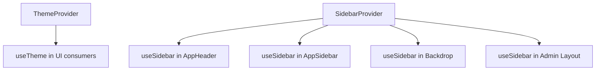

# State Management Guide

**Generated:** 2026-04-03T23:28:14.147Z

## Overview

This document describes how state is managed in TailAdmin, covering global context providers, custom hooks, local component state patterns, and context subscription behavior.

## Global State with Context Providers

TailAdmin uses React Context for cross-cutting UI state that must be shared across layouts and many components.

### Provider Hierarchy

Root provider composition is defined in `src/app/layout.tsx`:

```tsx
<ThemeProvider>
  <SidebarProvider>{children}</SidebarProvider>
</ThemeProvider>
```

### ThemeContext (`src/context/ThemeContext.tsx`)

**Purpose:** Global dark/light theme state with localStorage persistence.

| Field | Type | Purpose |
|-------|------|---------|
| `theme` | `Theme` | Holds the active visual theme and drives dark/light class behavior. |
| `toggleTheme` | `() => void` | Switches theme between light and dark modes. |


**Subscription points detected:** 2

- `src/components/common/ThemeToggleButton.tsx`
- `src/components/common/ThemeTogglerTwo.tsx`


### SidebarContext (`src/context/SidebarContext.tsx`)

**Purpose:** Shared sidebar navigation state for desktop and mobile behaviors.

| Field | Type | Purpose |
|-------|------|---------|
| `isExpanded` | `boolean` | Desktop sidebar expanded/collapsed state. |
| `isMobileOpen` | `boolean` | Mobile drawer open/close state. |
| `isHovered` | `boolean` | Temporary desktop hover state when collapsed. |
| `activeItem` | `string | null` | Tracks current active sidebar item. |
| `openSubmenu` | `string | null` | Tracks currently open submenu identifier. |
| `toggleSidebar` | `() => void` | Toggles desktop sidebar width state. |
| `toggleMobileSidebar` | `() => void` | Opens/closes sidebar on mobile screens. |
| `setIsHovered` | `(isHovered: boolean) => void` | Manually sets hover state from layout interactions. |
| `setActiveItem` | `(item: string | null) => void` | Sets active item for navigation highlighting. |
| `toggleSubmenu` | `(item: string) => void` | Opens/closes a submenu by item key. |


**Subscription points detected:** 4

- `src/app/(admin)/layout.tsx`
- `src/layout/AppHeader.tsx`
- `src/layout/AppSidebar.tsx`
- `src/layout/Backdrop.tsx`


## Custom Hooks

### useModal (`src/hooks/useModal.ts`)

**Purpose:** Reusable open/close/toggle state abstraction for modal UI.

- Supports optional initial value: Yes (`initialState = false`)
- Returns: `isOpen`, `openModal`, `closeModal`, `toggleModal`
- Internally uses `useState` + `useCallback`

**Consumers detected:** 9

- `src/components/calendar/Calendar.tsx`
- `src/components/example/ModalExample/DefaultModal.tsx`
- `src/components/example/ModalExample/FormInModal.tsx`
- `src/components/example/ModalExample/FullScreenModal.tsx`
- `src/components/example/ModalExample/ModalBasedAlerts.tsx`
- `src/components/example/ModalExample/VerticallyCenteredModal.tsx`
- `src/components/user-profile/UserAddressCard.tsx`
- `src/components/user-profile/UserInfoCard.tsx`
- `src/components/user-profile/UserMetaCard.tsx`


#### Example

```tsx
const { isOpen, openModal, closeModal } = useModal();

<Button onClick={openModal}>Open Modal</Button>
<Modal isOpen={isOpen} onClose={closeModal} />
```

### useGoBack (`src/hooks/useGoBack.ts`)

**Purpose:** Navigation helper that safely returns to previous page or redirects home.

- Uses Next.js router: `useRouter`
- Fallback route when no history exists: `/`

**Consumers detected:** 0

- No current consumers detected.


#### Example

```tsx
const goBack = useGoBack();

<button onClick={goBack}>Back</button>
```

## Local vs Global State Patterns

### Global State (Context)

Use context when state must be synchronized across distant components.

- Theme synchronization: header toggles + entire app styling
- Sidebar synchronization: header button, sidebar panel, backdrop, admin layout spacing

### Local State (Component)

Use local `useState` when state is private to a component or page section.

- App header menu toggling
- Sidebar submenu open/close in component-local structure
- Form input and UI interaction state

### Reusable Local State (Custom Hooks)

Use custom hooks when local state pattern repeats in multiple components.

- `useModal`: repeated in calendar, examples, and profile modals
- `useGoBack`: reusable navigation fallback pattern

## Context Subscription Model

Components subscribe to context changes through custom hooks (`useTheme`, `useSidebar`).
When provider values update, subscribed components re-render automatically with the latest state.



## Recommended Usage Rules

- Keep context state focused and UI-centric (theme/sidebar only)
- Keep page/form details as local state unless shared globally
- Wrap repeated state logic into custom hooks before introducing new context
- Keep provider APIs minimal and explicit to reduce accidental re-renders

## Cross-References

- [Architecture Documentation](./architecture.md) - Provider placement and layout composition
- [Styling Guide](./styling.md) - Theme and dark mode implementation
- [Modals & Dropdowns](./modals-dropdowns.md) - Modal interaction patterns
- [Integration Patterns](./integration-patterns.md) - How to add new providers and hooks

---

*This documentation was automatically generated. Last updated: 2026-04-03T23:28:14.147Z*
